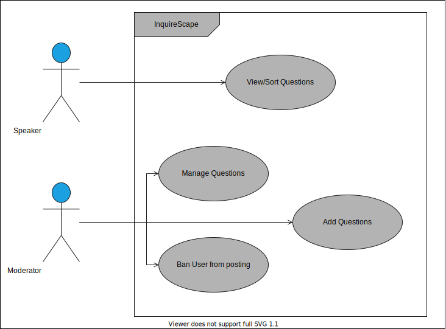
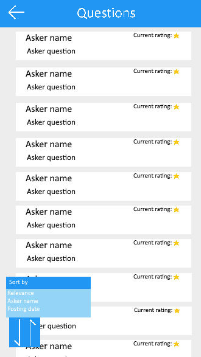

# InquireScape

- [Business Modeling](#business-modeling)
  - [Product Vision](#product-vision)
  - [Elevator Pitch](#elevator-pitch)
- [Requirements](#requirements)
  - [Use Cases](#use-cases)
  - [User Stories](#user-stories)
  - [Problem Domain](#problem-domain)
- [Architecture and design](#architecture-and-design)
  - [Logical Architecture](#logical-architecture)
  - [Physical Architecture](#physical-architecture)
- [Implementation](#implementation)
- [Test](#test)
- [Configuration and Change management](#configuration-and-change-management)
- [Project Management](#project-management)

---

# Business Modeling

## Product Vision
The app aims to remove the need for attendees to use a third-party app to post questions, while giving a moderation team a platform to hilghlight the best questions and relay them to the speaker.


## Elevator Pitch
Lots of speakers in conferences have a hard time managing the questions asked by the attendees and the presentation itself, wasting time that could be used to enrich the conference. Our application aims to solve that broken link by giving a platform for attendees to post their questions, where a moderation team will review, sort by relevance and redirect them to the speaker. Using our app, wasted time gets converted into productive time.

---

# Requirements

## Use Cases


**View/Sort Questions**:
- **Actor**: Speaker.
- **Description**: Gives the speaker the option to view the questions asked and sort them by different parameters.
- **Preconditions**: In order to access the questions, the speaker must login into his account on the app and join the conference in question.
- **Postconditions**: If successful, the questions will be displayed on the speaker's screen.
- **Normal Flow**:
  1. The speaker chooses the parameters for sorting the questions;
  2. The questions are sorted and displayed on the screen.
- **Alternative Flows and Exceptions**:
  1. The speaker doesn't choose any parameters for sorting the questions;
  2. The sorting is done by the default parameters and are displayed on the screen.

**Manage Questions**:
- **Actor**: Moderator.
- **Description**: Allows the moderators to manage the question (edit, delete, etc) before redirecting them to speaker, so it allows better time management in conference.
- **Preconditions**: In order to manage the question, the moderator must login into his account and join the conference in question.
- **Postconditions**: In the end, the action chosen by the moderator is applied and updates the database accordingly.
- **Normal Flow**:
  1. The moderator presses the button to delete a question;
  2. A confirmation prompt opens to verify the decision;
  3. If confirmed, the question is deleted, otherwise the action is cancelled and returns to the question page.
- **Alternative Flows and Exceptions**:
  1. The moderator presses the button to edit a question;
  2. The edition page is opened, allowing the moderator to change multiple fields regarding the question;
  3. The moderator presses the save button, and all the changes are saved into the database;
  4. App returns to the question page with the changes applied.

  - **OR**
  1. The moderator presses the button to edit a question;
  2. The edition page is opened, allowing the moderator to change multiple fields regarding the question;
  3. The moderator presses the return button;
  4. A prompt for verification opens to confirm the cancellation of the changes made;
  5. If confirmed, the changes are discarded and returns to the question page, otherwise it stays on the edition page.
- **Add Questions**:
  - **Actor**: Moderator.
  - **Description**: Allows the moderator to also add his own questions.
  - **Preconditions**: In order to add the question, the moderator must login into his account and join the conference in question.
  - **Postconditions**: In the end, the question is added to the database.
  - **Normal Flow**:
    1. The moderator presses the button to add a question;
    2. The moderator types his question;
    3. The moderator presses the confirm button, and the question is added to the database and displayed on the question list.
  - **Alternative Flows and Exceptions**:
    1. The moderator presses the button to add a question;
    2. The moderator types his question;
    3. The moderator presses the cancel button;
    4. A confirmation prompt is opened to confirm the cancellation;
    5. If confirmed, the question is discarded and returns to the question list page, otherwise it stays on the page to add question.
**Ban User from posting**:
  - **Actor**: Moderator.
  - **Description**: Allows the moderator to ban a user from posting questions on the conference.
  - **Preconditions**: In order to ban a user, the moderator must login into his account and join the conference in question.
  - **Postcondition**: The user banned can't add new questions.
  - **Normal Flow**:
    1. TBD
  - **Alternative Flows and Exceptions**:
    1. TBD


## User Stories

### **View All Questions**
As a moderator, I would like to see all the questions asked in the conference, so that I am able to manage them.

#### **UI mockup**


#### **Acceptance Tests**
```gherkin
Scenario: Displaying a question
  Given A list of questions
  When  I enter the page containing the list of questions
  Then  I should see the questions stored in the database
```

```gherkin
Scenario: Displaying questions without a selected conference
  Given I haven't selected a conference
  When  I select the questionsList
  Then  The questionsList will display a warning message
```

#### **Value and Effort**
Value: Must have

Effort: S

### **Sorting Questions**
As a speaker, I would like to receive my questions in order of importance, so that I can use the conference time more effectively.

#### **UI mockup**




#### **Acceptance Tests**
```gherkin
Scenario: Sorting questions by rating
  Given A list of questions
  When  I select to sort questions by rating
  Then  The questions with higher rating are displayed at the top
```

```gherkin
Scenario: Sorting an empty list of questions
  Given A an empty question list
  When  I select the questionsList page
  Then  I shouldn't see the sortingButton on screen
```

#### **Value and Effort**
Value: Must have

Effort: M

### **Editing Questions**
As a moderator, I'd like to edit a question, so that I can make it more clear before redirecting it to the speaker.

#### **UI mockup**


#### **Acceptance Tests**
```gherkin
Scenario: Edit a question
  Given A questionCard
  When  I click the EditQuestionButton
  Then  A questionEditor should appear on screen
```

#### **Value and Effort**
Value: Must have

Effort: L

As a moderator, I should get an error message if I edit a question into an empty string, so that every question has information in it.

#### **UI mockup**


#### **UI mockup**


#### **UI mockup**


```gherkin
Scenario: User deletes question's description
  Given The questionEditor has been opened
  And   I remove the original question description
  When  I click the saveChangesButton
  Then  A warning should appear on screen
```
#### **Value and Effort**
Value: Optional

Effort: M

#### **Creating a conference**
As a user, I should be prevented from creating a conference before today, so that I notice that mistake and fix it.

#### **UI mockup**


## Problem Domain

---

# Architecture and design

## Logical Architecture

## Physical Architecture

---

# Implementation

## Project Iteration 1
**Changelog:**
- Added a page to list all questions
- Added a page to focus on a single question
- Added a page to edit a questions and locally save its changes

**Screenshots:**


## Project Iteration 2
**Changelog:**
- Introduced Firebase database management
- Added a login page
- Added firebase login validation
- Added a main aplication drawer to facilitate page navigation 
- Added "Current Conference" page to access the event's information
- Added "Post Question" page
- Added "My Conferences" page to view all of the user's active conferences
- Added "Create new Conference" to add a new conference to the database
- Gherkin tests compatibility
- Major redesign of Questions


**Screenshots:**


## Project Iteration 3
**Changelog:**
- Added sorting by Date, Rating, Author, Platform to QuestionsListPage
- Added ascending and descending sorting of questions
- Added new page for managing user invites to new events
- Added home page and improved UX by changing the navigation focus away from the drawer and into the more intuitive home screen
- Added firebase support for talk invitations
- Added light theme and dark theme
- Added profile page
- Added about page
- Implemented a new gherkin test for user login scenario
- Fixed bugs regarding widget states after data changes


**Screenshots:**


---

# Test

---

# Configuration and Change Management

---

# Project Management

To plan and manage our project we are using [GitHub Projects](https://github.com/FEUP-ESOF-2020-21/open-cx-t1g4-gof/projects/1).

---
