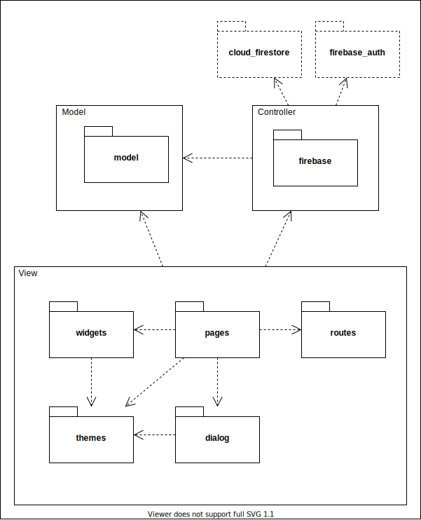

# InquireScape

- [Business Modeling](#business-modeling)
  - [Product Vision](#product-vision)
  - [Elevator Pitch](#elevator-pitch)
- [Requirements](#requirements)
  - [Use Cases](#use-cases)
  - [User Stories](#user-stories)
  - [Problem Domain](#problem-domain)
- [Architecture and design](#architecture-and-design)
  - [Logical Architecture](#logical-architecture)
  - [Physical Architecture](#physical-architecture)
  - [Prototype](#prototype)
- [Implementation](#implementation)
- [Test](#test)
- [Configuration and Change management](#configuration-and-change-management)
- [Project Management](#project-management)

---

# Business Modeling

## Product Vision
The app aims to remove the need for attendees to use a third-party app to post questions, while giving a moderation team a platform to hilghlight the best questions and relay them to the speaker.


## Elevator Pitch
Lots of speakers in talks have a hard time managing the questions asked by the attendees and the presentation itself, wasting time that could be used to enrich the talk. Our application aims to solve that broken link by giving a platform for attendees to post their questions, where a moderation team will review, sort by relevance and redirect them to the speaker. Using our app, wasted time gets converted into productive time.

---

# Requirements

## Use Cases


**View/Sort Questions**:
- **Actor**: Speaker.
- **Description**: Gives the speaker the option to view the questions asked and sort them by different parameters.
- **Preconditions**: In order to access the questions, the speaker must login into his account on the app and join the talk in question.
- **Postconditions**: If successful, the questions will be displayed on the speaker's screen.
- **Normal Flow**:
  1. The speaker chooses the parameters for sorting the questions;
  2. The questions are sorted and displayed on the screen.
- **Alternative Flows and Exceptions**:
  1. The speaker doesn't choose any parameters for sorting the questions;
  2. The sorting is done by the default parameters and are displayed on the screen.

**Manage Questions**:
- **Actor**: Moderator.
- **Description**: Allows the moderators to manage the question (edit, delete, etc) before redirecting them to speaker, so it allows better time management in talk.
- **Preconditions**: In order to manage the question, the moderator must login into his account and join the talk in question.
- **Postconditions**: In the end, the action chosen by the moderator is applied and updates the database accordingly.
- **Normal Flow**:
  1. The moderator presses the button to delete a question;
  2. A confirmation prompt opens to verify the decision;
  3. If confirmed, the question is deleted, otherwise the action is cancelled and returns to the question page.
- **Alternative Flows and Exceptions**:
  1. The moderator presses the button to edit a question;
  2. The edition page is opened, allowing the moderator to change multiple fields regarding the question;
  3. The moderator presses the save button, and all the changes are saved into the database;
  4. App returns to the question page with the changes applied.

  **OR**

  1. The moderator presses the button to edit a question;
  2. The edition page is opened, allowing the moderator to change multiple fields regarding the question;
  3. The moderator presses the return button;
  4. A prompt for verification opens to confirm the cancellation of the changes made;
  5. If confirmed, the changes are discarded and returns to the question page, otherwise it stays on the edition page.


- **Add Questions**:
- **Actor**: Moderator.
- **Description**: Allows the moderator to also add his own questions.
- **Preconditions**: In order to add the question, the moderator must login into his account and join the talk in question.
- **Postconditions**: In the end, the question is added to the database.
- **Normal Flow**:
  1. The moderator presses the button to add a question;
  2. The moderator types his question;
  3. The moderator presses the confirm button, and the question is added to the database and displayed on the question list.
- **Alternative Flows and Exceptions**:
  1. The moderator presses the button to add a question;
  2. The moderator types his question;
  3. The moderator presses the cancel button;
  4. A confirmation prompt is opened to confirm the cancellation;
  5. If confirmed, the question is discarded and returns to the question list page, otherwise it stays on the page to add question.

**Ban User from posting**:
  - **Actor**: Moderator.
  - **Description**: Allows the moderator to ban a user from posting questions on the talk.
  - **Preconditions**: In order to ban a user, the moderator must login into his account and join the talk in question.
  - **Postcondition**: The user banned can't add new questions.
  - **Normal Flow**:
    1. The moderator selects a question
    2. The moderator opens question options
    3. The moderator bans a user
    4. The database will no longer accept questions from that user in the current talk
  - **Alternative Flows and Exceptions**:
    1. The moderator selects a question
    1. The moderator opens question options
    1. The moderator bans a user
    1. The user is a moderator
    1. Ban is not applied because they have the same 'rank' 

    **OR**
    
    1. The moderator selects a question
    1. The moderator opens question options
    1. The user is already banned
    1. The ban has no effect 


## User Stories

### View All Questions
As a moderator, I would like to see all the questions asked in the talk, so that I am able to manage them.

**Value:** Must have  
**Effort:** S

#### Acceptance Tests
```gherkin
Scenario: Displaying a question
  Given A list of questions
  When  I enter the page containing the list of questions
  Then  I should see the questions stored in the database
```

```gherkin
Scenario: Displaying questions without a selected talk
  Given I haven't selected a talk
  When  I select the questionsList
  Then  The questionsList will display a warning message
```

#### UI mockup


---

### Editing Questions
As a moderator, I'd like to edit a question, so that I can make it more clear before redirecting it to the speaker.

**Value:** Must have  
**Effort:** L

#### Acceptance Tests
```gherkin
Scenario: Edit a question
  Given A questionCard
  When  I click the EditQuestionButton
  Then  A questionEditor should appear on screen
```
```gherkin
Scenario: User deletes question's description
  Given The questionEditor has been opened
  And   I remove the original question description
  When  I click the saveChangesButton
  Then  A warning should appear on screen
```

#### UI mockup


---

### Sorting Questions
As a speaker, I would like to receive my questions in order of importance, so that I can use the talk time more effectively.

**Value:** Must have  
**Effort:** M

#### Acceptance Tests
```gherkin
Scenario: Sorting questions by rating
  Given A list of questions
  When  I select to sort questions by rating
  Then  The questions with higher rating are displayed at the top
```

```gherkin
Scenario: Sorting an empty list of questions
  Given A an empty question list
  When  I select the questionsList page
  Then  I shouldn't see the sortingButton on screen
```

#### UI mockups

 

---

### Recent Questions
As a moderator, I would like to see the most recent questions asked in a talk, so that I am able to be updated with the question flow.

**Value:**: Could have  
**Effort:**: L

#### Acceptance Tests
```gherkin
Scenario: Displaying the most recent questions
    Given A list of questions
    When I enter the home page in a talk
    Then I should see the three most recent questions
```

---

### Upload a Question as a Moderator
As a moderator, I should be able to upload a question, so that the speaker is able to awnser my questions.

**Value:** Optional  
**Effort:** S

#### Acceptance Tests
```gherkin
Scenario: Upload a question
  Given I have the PostQuestion page on screen
  When I fill the question form
  And I click the save button
  Then I should have the new question on screen
```

---

### Uploading a Question as a User
As a User, I want to upload my Question so that it can be answered.

**Value:** Must have  
**Effort:** XL

#### Acceptance Tests
```gherkin
Scenario: Uploading my question
    Given I am in a streaming platform
    When I type my question
    Then My question should be uploaded
    And Appear in the app
```

---

### Create a talk
As a moderator I should be able to create a new talk at a given date.

**Value:** Must have  
**Effort:** M

#### Acceptance Tests
```gherkin
Scenario: Create a new Talk
  Given The I have the AddConferencePage on screen
  When I fill the title and description forms
  And I select an hour and a date
  And I add some tags
  When I click the Create button
  Then I should have the new talk selected
```
#### UI mockup


---

### Focusing a Talk
As a moderator, I would like to focus on a specific talk, so that I am able to see its contents.

**Value**: Must have  
**Effort**: M

#### Acceptance Tests
```gherkin
Scenario: Focusing a talk
    Given A list of talks
    When I tap one of the talks
    Then The screen is updated with the talk's content 
```

---

### Invite Moderator into Talk
As moderator I should be able to invite another moderator into one of my talks

**Value:** Must have  
**Effort:** L

#### Acceptance Tests
```gherkin
  Given I have a an active Talk
  And I have the TalkFullPage on screen
  When I click the InviteMod button
  Then I should see the invitePopup widget
  When I fill the ModName textForm
  And I click the Invite button
  Then an invitation should have been sent
```

---

### Accept Talk Invitation
As moderator I should be able to accept invitations to talks sent by other moderators

**Value:** Must have  
**Effort:** L

#### **Acceptance Tests**
```gherkin
  Given I have the acceptInvitesPage on screen
  When I click the accept button
  When I travel to the TalksPage
  Then I should see the accepted talk
```


## Problem Domain


Our database is implemented in the no-sql model (JSON like) offered by Google's Cloud Firestore services.

We have two main collections:
- Moderators
- Conferences (analogous to talks)

Every moderator has, besides the attributes present in the UML, a collection of references to the conferences the moderator is in. This collection is represented as an association in the UML.

Every conference has, besides the attributes present in the UML, a list of topics, represented as an aggregation and a collection of questions, represented as a composition.

Every question has, besides the attributes present in the UML, a collection of pairs of references to a moderator and their respective rating, represented as a composition in the UML.

---

# Architecture and design

## Logical Architecture



Our project is structured under the MVC (Mode View Controller) model. Within the View, we structure our code following a Widget oriented perspective.

- `model`    - Stubs for data stored in the database
- `firebase` - Interface for authentication and database services
- `widgets`  - Custom widgets used in multiple screens or with sufficient complexity
- `pages`    - Every page is individually represented here
- `routes`   - The various routes of the app and the animations between pages
- `themes`   - Theme data for the custom light and dark theme
- `dialog`   - Dialogues used in the app (pop ups/modals)


## Physical Architecture


Our project can be divided in the following parts:
- A Flutter app that runs on the moderator's smartphone.
- Google's Firebase Authentication and Cloud Firestore to store login and talk data.
- A server (or more) running a bot for Discord (or another platform) to automatically collect questions and add them to Firestore.

Among the numerous technologies available for mobile development, we chose to use [Flutter](https://flutter.dev/) as it provides easy to learn tools to build our app and abstracts the specifications for either android or IOS devices. Although [React Native](https://reactnative.dev/) is also a viable choice, the general consensus that Flutter's documentation is superior lead us to choose the latter.

To store the needed data for our app, we considered if we wanted to host our own no-sql database or adopt a ready-to-use system such as [Firebase](https://firebase.google.com/). Thanks to Firebase's limited, but free data plan, their secure handling of user personal data and ease of integration with multiple services (our app and our bot(s)), it was the superior choice.

From all available streaming platforms, [Youtube](https://developers.google.com/youtube/v3/live/getting-started) had by far the worst and ever-changing API, so that option would not be viable long-term. Although we could have used [Twitch's API](https://dev.twitch.tv/docs/api/), due to time constraints and previous familiarity with Discord's API (and [Discord.py](https://discordpy.readthedocs.io/en/latest/)), we opted for the latter, as many talks are also being held in private discord servers and our app could still function in such an environment.


## Prototype

To help on validating all the architectural, design and technological decisions made, we implemented a vertical prototype, a thin vertical slice of the system during the development of iteration 0 and 1, in which we developed a small app that implemented the user story [View all Questions](#view-all-questions). This served as the prototype for the features that would be implemented further on.

---

# Implementation

## Project Iteration 1
**Changelog:**
- Added a page to list all questions
- Added a page to focus on a single question
- Added a page to edit a questions and locally save its changes

**Screenshots:**

   

## Project Iteration 2
**Changelog:**
- Introduced Firebase database management
- Added a login page
- Added firebase login validation
- Added a main aplication drawer to facilitate page navigation 
- Added "Current talk" page to access the event's information
- Added "Post Question" page
- Added "My talks" page to view all of the user's active talks
- Added "Create new talk" to add a new talk to the database
- Gherkin tests compatibility
- Major redesign of Questions


**Screenshots:**

    


## Project Iteration 3
**Changelog:**
- Added sorting by Date, Rating, Author, Platform to QuestionsListPage
- Added ascending and descending sorting of questions
- Added new page for managing user invites to new events
- Added home page and improved UX by changing the navigation focus away from the drawer and into the more intuitive home screen
- Added firebase support for talk invitations
- Added light theme and dark theme
- Added profile page
- Added about page
- Implemented a new gherkin test for user login scenario
- Fixed bugs regarding widget states after data changes


**Screenshots:**

    


## Project Iteration 4
**Changelog:**
- Moderator can now rate a question and change their previous ratings
- Implemented refresh for talk list, question list and invites pages
- Implemented periodic updates to guarantee lastest questions are shown on the Home Page
- Added discord bot integration
  - $$setTalk talkID ~ Sets the channel to track the given talk
  - $$unsetTalk ~ Removes a talk previously bound to the channel
  - $q question ~ Automatically adds the question to InquireScape (if used in a channel previously bound with $$setTalk)
  - All commands with the prefix $$ are for exclusive use by server members with admin level permissions
- Fixed bugs related to the app loading too fast and the firebase data hadn't been parsed obtained yet
- Implemented unit tests for talkCard
- Implemented unit tests for QuestionCard
- Implemented unit tests for Login Validators

**Final version:**

#### InquireScape App

    

#### Discord Integration Bot


---

# Test
The features we chose to test are the following:
 + Login feature
 + Login field validators
 + talk card widget
 + Question card widget

## Test cases specifications
**Acceptance tests**
Tested with flutter_gherkin package:
 + [Login feature](test/test_driver/features/Login.feature)

**Unit tests**
For each widget we tested if they were being displayed with the currect data and for the validators
we checked if they were validating emails as intended:
 + [Talk Card](test/tests/conferenceCard_test.dart)
 + [Question Card](test/tests/questionCard_test.dart)
 + [Validators](test/tests/validators_test.dart)

---

# Configuration and Change Management
During the development of our project we followed all the GitHub conventions by using descriptive commit messages, tags, branches and issues. 
 + [GitHub Pulse](https://github.com/FEUP-ESOF-2020-21/open-cx-t1g4-gof/pulse/monthly)
 + [GitHub Network](https://github.com/FEUP-ESOF-2020-21/open-cx-t1g4-gof/network)
 + [GitHub Issues](https://github.com/FEUP-ESOF-2020-21/open-cx-t1g4-gof/issues?q=is%3Aissue+is%3Aclosed)
 
---

# Project Management

To plan and manage our project we are using [GitHub Projects](https://github.com/FEUP-ESOF-2020-21/open-cx-t1g4-gof/projects/1).

---
